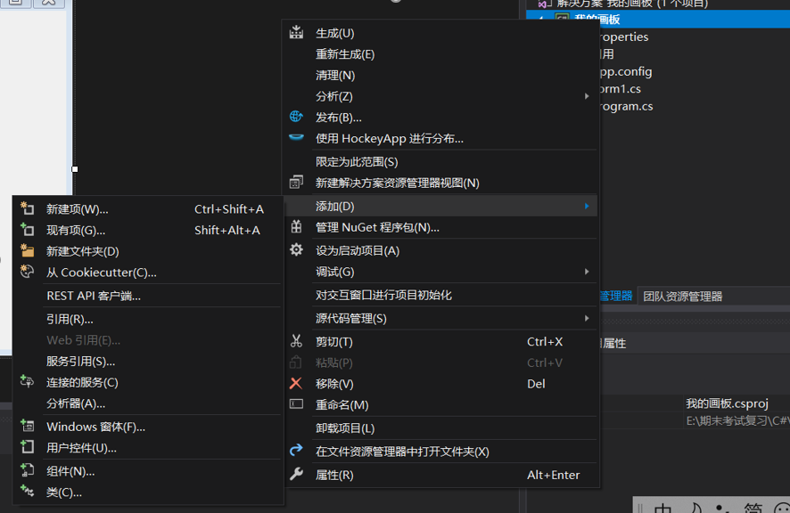
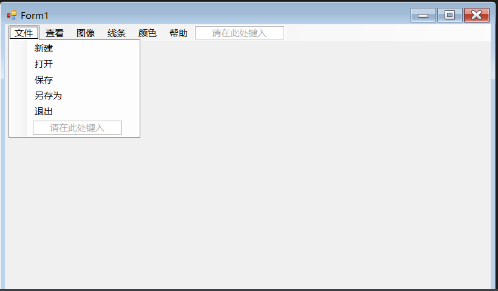
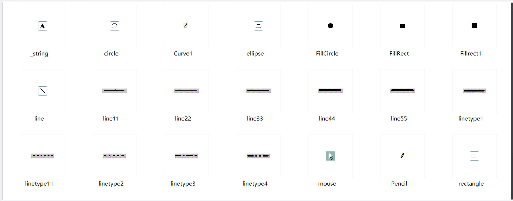
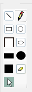
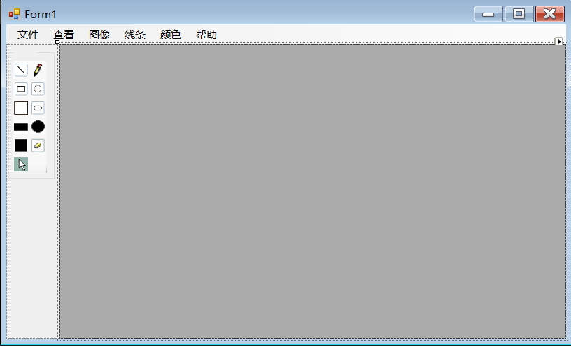
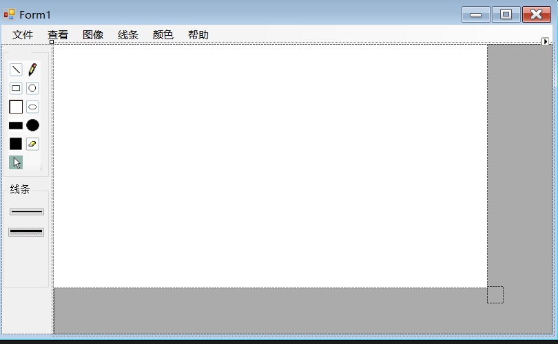
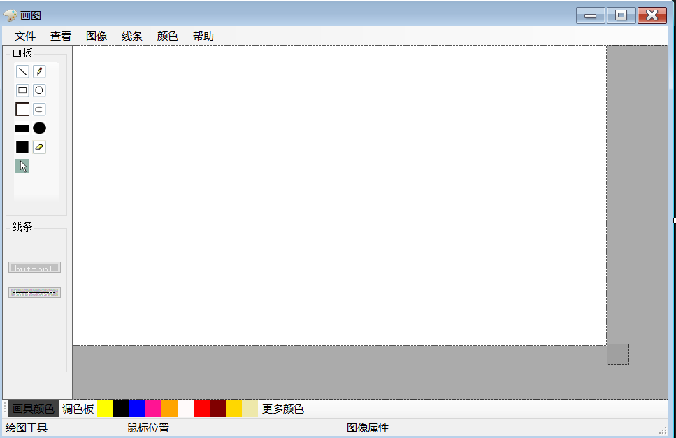
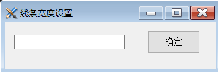

# C#实现简易绘图工具


### 一.  引言

**实验目的:通过制作窗体应用程序(C#画图软件),熟悉基本的窗体设计过程以及控件设计,事件处理等,熟悉使用C#的winform窗体进行绘图的基本步骤,对于面向对象编程有更加深刻的体会.**


#### Tutorial任务

设计一个具有基本功能的画图软件**

·包括简单的新建文件,保存,重新绘图等功能**

·实现一些基本图形的绘制,包括铅笔和基本形状等,学习橡皮工具的创建**

·设计一个合理舒适的UI界面**

注明:你可能需要先了解一些关于winform窗体应用程序绘图的基本知识,以及关于GDI+类和结构的知识

关于C#图形设计:https://blog.csdn.net/qq_37813928/article/details/79984364


### 二.实验环境

Windows系统下的visual studio 2017

C#窗体应用程序


### 三.实验流程

**1.首先,新建一个项目,取名为"我的画板"**

对于画板来说,其中很重要的就是工具,因此,我们需要创建一个类用来存放需要的画图工具,比较常见的功能有绘制直线,矩形,椭圆形,圆形,正方形,以及绘制填充矩形,椭圆形,圆形等,同样,我们还需要橡皮对画错的地方进行修改.

在项目中创建一个名为drawtools的类,如下图所示:



**2.在创建好的类中创建我们的工具**

(1)声明一些变量

```c#
 public Graphics DrawTools_Graphics; //目标绘图板
 private Pen p;
 private int lineWidth = 3;//划线的宽度设置为3
 private Image orginalImg;//原始画布,用来保存已经完成的绘图过程
 private Color drawColor = Color.Black;//绘图的画笔颜色初始化为黑色
 private Color backColor = Color.White;//绘图区域的背景颜色
 private Graphics newgraphics;//中间画板
 private Image finishImg;//中间画布,用来保存绘图过程中的痕迹
```

为了更加有效地**防止造成图片抖动**,从而防止记录不必要的绘图过程中的痕迹,我们的画要先在**中间画板上完成,然后再将绘制好的图画一次性导到目标画板上**

(2)属性部分,通过get和set方法设置绘图颜色,背景颜色,线条粗细以及获得原始画布

```c#
       //绘图颜色属性
        public Color Drawcolor
        {
            get { return drawColor; }
            set
            {
                drawColor = value;
                p.Color = value;//将画笔颜色也调整为所需要的颜色
            }
        }
        //背景颜色属性
        public Color Backcolor
        {
            get { return backColor; }
            set
            {
                backColor = value;
            }
        }
        //线条粗细属性
        public int LineWidth
        {
            get { return lineWidth; }
            set
            {
                lineWidth = value;
                p.Width = value;//将画笔的粗细也设置为线条宽度
            }
        }
        //创建画布
        public Image OrginalImg
        {
            get { return orginalImg; }
            set
            {
                finishImg = (Image)value.Clone();
                orginalImg = (Image)value.Clone();//创建两个副本,作为原始画布和中间画布
            }
        }
```

(3)使用构造函数对绘图工具进行初始化

```c#
       //bool变量startDraw表示是否要开始绘图
        public bool startDraw = false;
        //设置绘图起点
        public PointF startPoint;
        /// <summary>
        /// 初始化绘图工具
        /// </summary>
        /// <param name="g">绘图板</param>
        /// <param name="c">绘图颜色</param>
        /// <param name="img">初始画布</param>
        /// <param name="linewidth">线条宽度</param>
        public DrawTools(Graphics g,Color c,Image img,int linewidth)
        {
            this.DrawTools_Graphics = g;
            this.drawColor = c;
            this.p = new Pen(c, linewidth);
            this.finishImg = (Image)img.Clone();
            this.OrginalImg = (Image)img.Clone();

        }
```

(4)绘制直线,矩形,圆形,正方形,填充圆形,填充矩形,填充正方形,填充椭圆形,这一部分包含以下几个步骤:

(i)实例化中间画板,**此时的画布为上次绘制结束时的副本(当第一次绘制时,画布是初始化的画布副本)**

(ii)按照选择的绘图样式在中间画板上进行绘制

(iii)绘制结束的图画应该画到中间画布上

这里面有一个值得注意的问题,那就是在绘图过程中,**用户需要能够实时地看到自己画画的过程(体现在目标画板上)**,所以在鼠标移动过程中,**为了看到效果,绘制的图画依然要显示在目标画板上,而最终绘制结束时的图片应当在鼠标松开时完成**,此时才将中间图画最后导出到原始画布上

```c#
Image img = (Image)OrginalImg.Clone();//为了防止直接对原始画布进行改写
newgraphics = Graphics.FromImage(img);//实例化中间画板
```


(4a)绘制直线,也就是在绘画起始位置与鼠标移动到的位置之间绘制一条直线

```c#
case "Line":
{
       newgraphics.DrawLine(p, startPoint, new Point(e.X, e.Y));
       break;
}
```


(4b)绘制一个矩形

值得注意的是,**鼠标移动到的位置与起始位置之间横向距离的绝对值就是矩形的宽,纵向距离的绝对值就是矩形的高,**但是由于鼠标移动的位置**可能会出现在起始位置的左侧或者上侧的情况,**因此要分类进行讨论:

例如,在鼠标移动位置位于起始位置的左侧时,由于矩形的长已经确定,所以**不妨将起始位置改为鼠标最后移动到的位置**,以免出现当鼠标移动到起始位置左侧时,无法成功绘制矩形.也就是说,我们要让矩形绘制的位置位于起始位置的右下方,讨论方式见以下:

```c#
case "Rectangle":
 {
     float width = Math.Abs(e.X - startPoint.X);//确定矩形的宽
     float height = Math.Abs(e.Y - startPoint.Y);//确定矩形的高
     PointF rectStartPoint = startPoint;//设置最终画出矩形的起始位置
     if (e.X < rectStartPoint.X)
     {
       rectStartPoint.X = e.X;//如果鼠标所处位置在画图起始位置左边,就把最终起始位置赋值为鼠标位置
     }
     if (e.Y < rectStartPoint.Y)
     {
        rectStartPoint.Y = e.Y;
     }
       newgraphics.DrawRectangle(p, rectStartPoint.X, rectStartPoint.Y, width, height);
       break;
 }
```


(4c)绘制一个正方形

与绘制矩形基本类似,区别在于,正方形的长和宽是等长的,因此,要选择矩形的长和宽中较短的边(或者较长的边)作为正方形的边长,代码如下:

```c#
 case "Square":
 {
 float width = Math.Abs(e.X - startPoint.X);
 float height = Math.Abs(e.Y - startPoint.Y);
 float bian = (width < height) ? width : height;
 PointF squareStartPoint = startPoint;
 if (e.X < startPoint.X)
 {
    squareStartPoint.X = startPoint.X - bian;//注意,这样设置是为了防止出现正方形到处移动的情况
  }
  if (e.Y < startPoint.Y)
  {
    squareStartPoint.Y = startPoint.Y - bian;
   }
    newgraphics.DrawRectangle(p, squareStartPoint.X, squareStartPoint.Y, bian, bian);
    break;
  }
```

写到这里我们会发现,用户在绘制图形时,如果向左上角进行绘制,表面上看是矩形的左上角向左上方移动,实际上则是从鼠标最后拖拽到的位置开始进行向右下角的绘制(也就是绘制起点是在矩形左上角,进行右下角方向的绘制)


(4d)绘制一个椭圆形

直接使用DrawEllipse的方法对于椭圆形进行绘制,这是一个用矩形边框画出椭圆的方法,可以理解为长是鼠标移动位置到起始位置x轴方向上的距离.同样,宽是鼠标移动位置到起始位置y轴方向上的距离.完全类比绘制矩形的情况,用代码实现绘制椭圆形

```c#
case "Ellipse":
{
    float width = Math.Abs(e.X - startPoint.X);
	float height = Math.Abs(e.Y - startPoint.Y);
    PointF rectStartPoint = startPoint;
    float bian = (width < height) ? width : height;//获取较小者                      
    if (e.X < startPoint.X)
    {
        rectStartPoint.X = startPoint.X - width;
    }
    if (e.Y < startPoint.Y)
    {
    	rectStartPoint.Y = startPoint.Y - height;
    }
    newgraphics.DrawEllipse(p, rectStartPoint.X, rectStartPoint.Y, width, height);
    break;
}
```


(4e)绘制一个圆形

与绘制正方形类似,在这里同样要判断鼠标位置,取长和宽中较短的边作为圆的直径(也就是相当于以一个正方形作为边框将圆形绘制进去)

```c#
 case "Circle":
{
    float width = Math.Abs(e.X - startPoint.X);
    float height = Math.Abs(e.Y - startPoint.Y);
    float bian = (width < height) ? width : height;
    PointF squareStartPoint = startPoint;
    if (e.X < startPoint.X)
    {
       squareStartPoint.X = startPoint.X - bian;//注意,这样设置是为了防止出现圆形到处移动的情况
    }
    if (e.Y < startPoint.Y)
    {
       squareStartPoint.Y = startPoint.Y - bian;
    }
    newgraphics.DrawEllipse(p, squareStartPoint.X, squareStartPoint.Y, bian, bian);
     break;
}
```


在画图板中,有的时候我们需要对图形进行颜色填充,这里我们将问题进行简化,不妨设置矩形填充,圆形填充,正方形填充,和椭圆形填充四个部分:

**关于绘制填充图形**


(4f)填充一个矩形

和创建矩形相似,唯一的不同是将绘制矩形的方法改为了填充矩形的方法,代码如下:

```c#
case "FillRectangle":
{
   float width = Math.Abs(e.X - startPoint.X);//确定矩形的宽
   float height = Math.Abs(e.Y - startPoint.Y);//确定矩形的高
   PointF rectStartPoint = startPoint;//设置最终画出矩形的起始位置
   if (e.X < rectStartPoint.X)
   {
      rectStartPoint.X = e.X;//如果鼠标所处位置在画图起始位置左边,就把最终起始位置赋值为鼠标位置
    }
    if (e.Y < rectStartPoint.Y)
    {
       rectStartPoint.Y = e.Y;
    }
     //填充一个矩形
     newgraphics.FillRectangle(new SolidBrush(drawColor), rectStartPoint.X, rectStartPoint.Y, width, height);
     break;
}
```


(4g)填充一个正方形

同样,类比创建正方形,代码如下:

```c#
case "FillSquare":
{
   float width = Math.Abs(e.X - startPoint.X);
   float height = Math.Abs(e.Y - startPoint.Y);
   float bian = (width < height) ? width : height;
   PointF squareStartPoint = startPoint;
   if (e.X < startPoint.X)
   {
     squareStartPoint.X = startPoint.X - bian;//注意,这样设置是为了防止出现正方形到处移动的情况
   }
    if (e.Y < startPoint.Y)
    {
     squareStartPoint.Y = startPoint.Y - bian;
    }
   newgraphics.FillRectangle(new SolidBrush(drawColor), squareStartPoint.X, squareStartPoint.Y, bian, bian);
   break;
 }
```


(4h)填充一个椭圆形以及填充一个圆形

同样,类比创建椭圆形以及创建圆形,可以写出如下的代码来对圆形和椭圆形进行填充

```c#
case "FillEllipse"://填充椭圆形
{
   float width = Math.Abs(e.X - startPoint.X);
   float height = Math.Abs(e.Y - startPoint.Y);
   PointF rectStartPoint = startPoint;
   float bian = (width < height) ? width : height;//获取较小者                      
   if (e.X < startPoint.X)
   {
     rectStartPoint.X = startPoint.X - width;
   }
   if (e.Y < startPoint.Y)
   {
     rectStartPoint.Y = startPoint.Y - height;
   }
   newgraphics.FillEllipse(new SolidBrush(drawColor), rectStartPoint.X, rectStartPoint.Y, width, height);
   break;
}
                    
case "FillCircle"://填充圆形                        
{                        
    float width = Math.Abs(e.X - startPoint.X);
    float height = Math.Abs(e.Y - startPoint.Y);
    float bian = (width < height) ? width : height;
    PointF squareStartPoint = startPoint;
    if (e.X < startPoint.X)
    {
       squareStartPoint.X = startPoint.X - bian;//注意,这样设置是为了防止出现圆形到处移动的情况
     }
     if (e.Y < startPoint.Y)
     {
        squareStartPoint.Y = startPoint.Y - bian;
     }
     newgraphics.FillEllipse(new SolidBrush(drawColor), squareStartPoint.X, squareStartPoint.Y, bian,bian);
      break;
}
```

在对于switch分支进行判断之后,**需要释放掉中间画板所占用的资源,同时需要重新建立一个以中间图片**

**作为画布的中间画板,并且将图片绘制在中间画板上,并最终绘制到目标画板上**

```c#
newgraphics.Dispose();//绘图完成后,释放中间画板所占用的资源
newgraphics = Graphics.FromImage(finishImg);//另外建立一个中间画板,画布为中间画布
newgraphics.DrawImage(img, 0, 0);//从最开始开始绘制,将图片画到中间画板  
newgraphics.Dispose();
DrawTools_Graphics.DrawImage(img, 0, 0);//在目标绘图板上绘制图片
img.Dispose();
```

在这里,我们做了如下的几件事

(1)  释放掉绘图所在的中间画板所占用的资源

(2)  重新建立一个以中间画布为画布的中间画板(举个例子,相当于我们事先在桌子上的一张纸上画了一幅画,现在当画作完成后,我们把桌子移走,(将这幅画进行誊写)再将这幅画放置在了黑板上(也就是最终的目标绘图板))

在绘图最终完成后,需要一个函数来把完成后的绘图过程保留下来,也就是将中间图片再绘制到原始画布上,代码如下:

```C#
public void EndDraw()
{
   startDraw = false;
   //为了将完成后的绘图过程保留下来,要将中间图片绘制到原始画布上
   newgraphics = Graphics.FromImage(orginalImg);
   newgraphics.DrawImage(finishImg, 0, 0);//将中间画布绘制的内容绘制到原始画布上
   newgraphics.Dispose();
}
```


至此,关于绘制各种基本形状的操作基本介绍完毕,接下来,需要在DrawTools类中加入橡皮擦功能以方便用户对于绘制的内容进行修改;

(5)橡皮擦工具

**橡皮擦工具的设置思路**

橡皮擦的作用是将之前绘制的图案抹除掉,转换一下思路我们可以理解为**使用一个与初始绘画区域颜色相同的形状去填充原来绘制的图案(比如如果初始绘画区域为白色,那么橡皮擦可以理解成用白色的矩形/椭圆形/圆形(通常是正方形)去填充之前绘制的图案),**想通了这一点之后,我们就可以写出关于橡皮擦的代码:

```c#
 public void Eraser(MouseEventArgs e)
        {
            if(startDraw)
            {
                newgraphics = Graphics.FromImage(finishImg);
                newgraphics.FillEllipse(new SolidBrush(Color.White), e.X, e.Y, 20, 20);
                newgraphics.Dispose();
                DrawTools_Graphics.DrawImage(finishImg, 0, 0);//将橡皮擦处理完之后的内容绘制在目标绘图板上
            }
        }
```


(6)铅笔工具

**铅笔工具的设置思路**

由于用户并非只是绘制简单图形,因此需要设置铅笔工具以让用户绘制自定义形状,而设置铅笔工具的要点就在于**如果绘制出看上去可以是”不规则”的形状,这里我们采用的方法是实时更新新的位置来模拟绘制任意曲线的过程,也就是将每次鼠标移动到的位置定义为当前位置,并且在之前位置与当前位置之间连一条直线**,由于刷新速度够快,因此看上去就像是在绘制任意曲线,这一部分的代码如下

```c
//铅笔工具
        public void DrawDot(MouseEventArgs e)
        {
            newgraphics = Graphics.FromImage(finishImg);
            PointF currentlocate = new PointF(e.X, e.Y);//当前位置定义为鼠标此刻的位置
            newgraphics.DrawLine(p, startPoint, currentlocate);//在之前位置与当前位置之间连一条线
            startPoint = currentlocate;//重复刚才的过程,起始位置变成了当前位置,达到刷新效果
            newgraphics.Dispose();
            DrawTools_Graphics.DrawImage(finishImg, 0, 0);//将处理完之后的内容绘制在目标绘图板上

        }
```


(7)在使用完画图工具后,**要清除变量以释放内存**

```c#
public void clearVar()
{
   DrawTools_Graphics.Dispose();
   finishImg.Dispose();
   orginalImg.Dispose();
   p.Dispose();
}
```

至此,关于DrawTools类的内容已经介绍完毕


**4.接下来,我们需要设计绘图工具的窗口,并且在相应的选项下面添加相应的功能**

1.首先是绘图窗体顶部的菜单栏,需要的较为常见的工具有:

(1)  文件:包括新建,打开,保存,另存为和退出五个功能

(2)  查看:在这里面可以查看工具箱,颜料库,和状态栏

(3)  图像:这里面加入了清除图像的功能

(4)  线条:可以选择粗细以及自定义

(5)  颜色:这里面可以编辑颜色与背景颜色

(6)  帮助:这里面是关于软件的一些基本信息

想好了以上工具之后,我们使用菜单—工具栏下面的menustrip来在窗体中设置以上功能,文件部分设置结果如下:




2.顶部菜单栏设置完成后,我们还需要左侧的工具栏,下方的线条栏,以及右侧的画布部分

(1)  新建一个Panel作为承载左侧工具栏的容器,取名为panel1,在默认参数的基础上对某些参数更改如下:

(a)  将布局中的Dock更改为”Left”,使得该容器在左侧显示

(b)将行为中的TabIndex(确定此控件将占用的Tab键顺序索引)设置为9

(2)  在panel1中放置两个groupbox,其中groupbox1用来存放画板中的工具,groupbox2用来存放线条样式,并新建一个toolstrip设置若干工具(铅笔,橡皮等),具体操作见(3)

(3)  首先,将toolstrip1调整为合适大小,使其放置在groupbox1中

(4)  然后,我们将所需要的素材导入,选择解决方案---properties---resourses.resx,导入我们所需要的素材,素材大概如下:



(5)开始逐一向左上角画板部分中添加功能(右键选择toolstrip1—编辑项,将我们所需要的工具的名称,图案等添加进去),分别为绘制直线,铅笔工具,矩形工具,圆形工具,正方形工具,椭圆形工具,矩形填充工具,椭圆形填充工具,橡皮工具,放置结果如下图所示:



(6)新建一个panel2用来承装画布等,创建完的效果如图所示:



(7)新建一个groupbox2,用来存放各种线条工具,然后将不同粗细的线条以button的形式放置在groupbox2中

(8)  新建一个picturebox用来当作画布,取名为pbImg

(9)  另外新建一个picturebox取名为reSize,方便后续调整画布的大小,以及确定每次新建文件的位置,以上面板设计完之后效果如下:



(10)  接下来,还有比较好用的功能是在窗体的左下角设置一个调色板以方便用户调节颜色,以及设置一个显示鼠标位置的功能方便用户确认绘画位置,最后,再设置整个窗体的图标和文字设置

这些部分都完成之后,对窗体的布局再进行简单的调整,以上所有窗体设计部分结束之后的结果如下:



接下来,我们会对其中的功能进行逐一完善:

首先,需要设置一些变量以便于我们后续操作,设置变量如下:

```c#
private DrawTools dt;//绘图工具
private int lineWidth;//设置线条宽度
private string sType;//绘图样式
private string sFilename;//如果需要打开文件,要打开文件的文件名
private bool bReSize = false;//判断是否改变画布大小
private Size DefaultPicSize;//储存原始画布大小，用来新建文件时使用
```

(1a)新建功能

这一部分的要点在于,**需要对画板和画布进行初始化,定义其初始位置以及resize的位置**,具体代码部分如下:

```c#
private void 新建ToolStripMenuItem_Click(object sender, EventArgs e)
        {
            pbImg.Size = DefaultPicSize;//pictureBox大小为原始画布大小
            this.panel1.AutoScrollPosition = new Point(0, 0);//初始化自动滚动的位置
            Bitmap bmp = new Bitmap(DefaultPicSize.Width, DefaultPicSize.Height);
            Graphics g = Graphics.FromImage(bmp);//初始化画板
            g.FillRectangle(new SolidBrush(Color.White), 0, 0, DefaultPicSize.Width, DefaultPicSize.Height);
            g.Dispose();
            g = pbImg.CreateGraphics();//绘制图像
            g.DrawImage(bmp, 0, 0);
            g.Dispose();
            reSize.Location = new Point(DefaultPicSize.Width, DefaultPicSize.Height);//将resize大小初始化
            dt.OrginalImg = bmp;
            sFilename = null;//新建时默认没有文件名
        }
```


(1b)这一部分最重要的就是理解好绘图板初始化的问题,代码如下:

 ```c#
private void 打开ToolStripMenuItem_Click(object sender, EventArgs e)
        {
            OpenFileDialog oFile = new OpenFileDialog();//发出一个打开文件的对话框
            oFile.Filter = "图像(*.bmp;*.jpg;*.ico;*.wmf;*.cur)|*.bmp;*.jpg;*.ico;*.wmf;*.cur";//文件类型筛选
            oFile.Multiselect = false;//不允许选择多个文件
            if(oFile.ShowDialog()==DialogResult.OK)
            {
                Bitmap bmpfrom = new Bitmap(oFile.FileName);
                panel2.AutoScrollPosition = new Point(0,0);
                pbImg.Size = bmpfrom.Size;//pictureBox大小初始化

                reSize.Location = new Point(bmpfrom.Width, bmpfrom.Height);//resize位置初始化,用来手动调节画板大小
                dt.DrawTools_Graphics = pbImg.CreateGraphics();
                //由于在初始化时空白画布大小有限，"打开"操作可能引起画板大小改变，所以要将画板重新传入工具类
                Bitmap bmp = new Bitmap(pbImg.Width, pbImg.Height);
                Graphics g = Graphics.FromImage(bmp);
                g.FillRectangle(new SolidBrush(pbImg.BackColor), new Rectangle(0, 0, pbImg.Width, pbImg.Height));
                //不使用上面这句话，那么这个bmp的背景就是透明的
                g.DrawImage(bmpfrom, 0, 0, bmpfrom.Width, bmpfrom.Height);
                g.Dispose();//释放画板所占资源
                bmpfrom.Dispose();
                //不直接使用pbImg.Image = Image.FormFile(ofd.FileName)是因为这样会让图片一直处于打开状态，也就无法保存修改后的图片
                g = pbImg.CreateGraphics();
                g.DrawImage(bmp, 0, 0);
                g.Dispose(); 
                dt.OrginalImg = bmp;
                bmp.Dispose();
                sFilename = oFile.FileName;//储存打开的图片文件的详细路径，用来稍后能覆盖这个文件
                oFile.Dispose();
            }
        }

 ```


(1c)保存

这一部分需要分两种情况进行讨论,**一种是用户之前已经命名过这个文件(也就是这个文件有文件名),另一种情况是该文件第一次被命名**,以上两种分情况讨论代码如下:

```c#
private void 保存ToolStripMenuItem_Click(object sender, EventArgs e)
        {
            if (sFilename != null)
            {
                if (MessageBox.Show("是否保存文件", "系统提示", MessageBoxButtons.YesNo) == DialogResult.Yes)
                {
                    dt.OrginalImg.Save(sFilename);
                }
            }
            else 
            {
                SaveFileDialog saveDialog = new SaveFileDialog();
                saveDialog.Filter = "图像(*.bmp;*.jpg;*.ico;*.wmf;*.cur)|*.bmp;*.jpg;*.ico;*.wmf;*.cur";
                if(saveDialog.ShowDialog()==DialogResult.OK)
                {
                    dt.OrginalImg.Save(saveDialog.FileName);
                    sFilename = saveDialog.FileName;
                }
            }
        }
```


(1d)另存为,这里面需要指定路径,代码如下:

```c#
private void 另存为ToolStripMenuItem_Click(object sender, EventArgs e)
        {
            SaveFileDialog sfd = new SaveFileDialog();
            sfd.Filter = "图像(*.bmp;*.jpg;*.ico;*.wmf;*.cur)|*.bmp;*.jpg;*.ico;*.wmf;*.cur";
            if(sfd.ShowDialog()==DialogResult.OK)
            {
                dt.OrginalImg.Save(sfd.FileName);
                sFilename = sfd.FileName;
            }
        }
```

(1e)退出

这一部分需要询问用户是否确定退出,如果是的话就退出窗口

```c#
private void 退出ToolStripMenuItem_Click(object sender, EventArgs e)
        {
            if (MessageBox.Show("是否确定要退出软件？", "系统提示", MessageBoxButtons.YesNo) == DialogResult.Yes)
            {
                dt.clearVar();
                Application.Exit();
            }
            
        }
```


**补充**:在窗口加载时就需要对我们之前所写的类进行实例化以及对变量进行初始化,在这里我们写了这样一个名为form1_load的函数

```c#
        private void Form1_Load(object sender, EventArgs e)
        {
            SetStyle(ControlStyles.OptimizedDoubleBuffer | ControlStyles.AllPaintingInWmPaint | ControlStyles.UserPaint, true);
            this.UpdateStyles();//以上两句是为了设置控件样式为双缓冲，这可以有效减少图片闪烁的问题
            Bitmap bmp = new Bitmap(pbImg.Width, pbImg.Height);
            Graphics g = Graphics.FromImage(bmp);
            g.FillRectangle(new SolidBrush(pbImg.BackColor), new Rectangle(0, 0, pbImg.Width, pbImg.Height));
            g.Dispose();
            dt = new DrawTools(this.pbImg.CreateGraphics(), Color.Black, bmp,3);//实例化工具类
            DefaultPicSize = pbImg.Size;
        }
```


同时,我们还要处理窗口的移动,最小化,最大化所造成的pbImg重画的时间问题,处理代码如下:

```c#
//窗口移动、最小化、最大化等造成的pbimg重画时间处理
        private void pbImg_Paint(object sender, PaintEventArgs e)
        {
            Graphics g = e.Graphics;
            g.DrawImage(dt.OrginalImg, 0, 0);
        
        }
```


**(2)”绘图工具选用”事件处理办法**

值得注意的是,**对于不用的工具,我们在使用的时候的鼠标光标要有所不同**,比如说在选择工具下鼠标光标会呈现指针形状,而在绘制矩形等形状时为了方便用户可以看清绘制大小,采用十字交叉形的光标.代码如下:

```c#
private void tool_Click(object sender, EventArgs e)
        {
            ToolStripButton tsb = sender as ToolStripButton;
            if (tsb != null)
            {
                sType = tsb.Name;
                currentDrawType.Text = tsb.Text;
                switch (sType)
                {
                    case "Dot":
                        pbImg.Cursor =Cursors.Hand;
                        break;
                    case "mouse":
                        pbImg.Cursor = Cursors.Default;
                        break;
                    case "Eraser":
                        pbImg.Cursor = new Cursor(Application.StartupPath + @"\pb.cur");
                        break;
                    default:
                        pbImg.Cursor = Cursors.Cross;
                        break;

                }
            }
        }
```

这一部分进行了一步**类似于强制类型转换的操作,as在遇到不能强制转换的时候,会返回一个null, sender是事件源,这句的意思是把引发该事件的事件源转成button类型as是用来强制类型转换的**,用as转换的好处是,转换失败不会出现异常，这样就比一般的转换更加安全,接下来,对于不同的绘图工具采用不同的光标,完成下面的绘图过程:


(3)绘图

在绘图时,用户会完成点击鼠标,鼠标移动以及鼠标松开这样三个动作,所以我们要创建三个事件已完成绘图过程

(3a)mousedown事件(当按下鼠标左键时绘图工具会被激活)

```c#
private void pbImg_MouseDown(object sender, MouseEventArgs e)
        {
            if (e.Button == MouseButtons.Left)
            {
                if (dt != null)
                {
                    dt.startDraw = true;//相当于所选工具被激活，可以开始绘图
                    dt.startPoint = new PointF(e.X, e.Y);
                    
                }
            }
        }
```

(3b)mousemove事件.在鼠标移动也就是正在绘制图像的过程当中,显示关于鼠标位置以及图像大小的信息

```c#
private void pbImg_MouseMove(object sender, MouseEventArgs e)
        {
            Thread.Sleep(6);//减少cpu占用率
            mouseposition.Text = "鼠标位置" + e.Location.ToString();
            toolStripStatusLabel2.Text = "图像大小: " + pbImg.Height + "px"+"*" + pbImg.Width + "px";
            if (dt.startDraw)
            {
                switch (sType)
                {
                    case "Dot": dt.DrawDot(e); break;
                    case "Eraser": dt.Eraser(e); break;
                    default: dt.Draw(e, sType); break;

                }
            }
        }
```

特别需要注意的是,**由于铅笔工具和橡皮擦工具需要实时更新鼠标的位置以方便绘制多样化图形,所以我们使用mousemove事件,使得绘画过程随着鼠标移动可以实时进行更新**


(3c)mouseup事件,在绘画完成之后.鼠标松开.触发结束绘画事件

```c#
private void pbImg_MouseUp(object sender, MouseEventArgs e)
        {
            if (dt != null)
            {
                dt.EndDraw();
            }
        }
```


(4)调整画布大小

这一部分与绘制图案在某些方面有相似之处,同样是在鼠标左键按下时开始进行画布大小调节,画布大小会跟随鼠标移动而发生改变,以及在鼠标松开时,大小改变结束,画布大小进行刷新.以下是这三个部分:

(4a)mousedown事件

```c#
 private void reSize_MouseDown(object sender, MouseEventArgs e)
        {
            bReSize = true;//当鼠标按下时，说明要开始调节大小
        }
```

(4b)mousemove事件,在移动resize块的时候,其位置发生改变,方便后续更新调整新的画布大小

```c#
private void reSize_MouseMove(object sender, MouseEventArgs e)
        {
            if (bReSize)
            {
                reSize.Location = new Point(reSize.Location.X + e.X, reSize.Location.Y + e.Y);

            }
        }
```

(4c)mouseup事件

在我们调节画板大小的过程中,画板大小可能会超过屏幕区域,所以我们需要实现将autoscroll设置为true;

但同时,滚动条的出现会导致其上下移动时并不会自动调整图片的坐标(滚动条上下移动改变的是文档坐标,但是客户区坐标不发生改变(因为location坐标属于客户区坐标,所以在直接计算时就会出现错误))

一种解决这个问题的方案是利用autoscrollposition提供的文档坐标与客户去坐标的偏移量,来确定好最终的坐标位置,代码如下:

```c#
private void reSize_MouseUp(object sender, MouseEventArgs e)
        {
            bReSize = false;//大小改变结束
            //重新定义画板位置
            pbImg.Size = new Size(reSize.Location.X - (this.panel1.AutoScrollPosition.X), reSize.Location.Y - (this.panel1.AutoScrollPosition.Y));
            dt.DrawTools_Graphics = pbImg.CreateGraphics();//因为画板的大小被改变所以必须重新赋值
            //另外画布也被改变所以也要重新赋值
            Bitmap bmp = new Bitmap(pbImg.Width, pbImg.Height);
            Graphics g = Graphics.FromImage(bmp);
            g.FillRectangle(new SolidBrush(Color.White), 0, 0, pbImg.Width, pbImg.Height);
            g.DrawImage(dt.OrginalImg, 0, 0);
            g.Dispose();
            g = pbImg.CreateGraphics();
            g.DrawImage(bmp, 0, 0);
            g.Dispose();
            dt.OrginalImg = bmp;

            bmp.Dispose();
        }
```


(5)清除图像

清除图像的本质在于,**用新的画布和画板去覆盖掉原来的画布和画板**,代码如下:

```c#
private void 清除图像ToolStripMenuItem_Click(object sender, EventArgs e)
        {
            Bitmap newpic = new Bitmap(pbImg.Width, pbImg.Height);
            Graphics g = Graphics.FromImage(newpic);
            g.FillRectangle(new SolidBrush(Color.White), 0, 0, pbImg.Width, pbImg.Height);
            g.Dispose();
            g = pbImg.CreateGraphics();
            g.DrawImage(newpic, 0, 0);
            g.Dispose();
            dt.OrginalImg = newpic;
        }
```


(6)在颜色板中调节颜色

在这一步骤中,我们需要设计方法,当用户下按对应的按钮时可以调整绘图工具的颜色,在主窗体下的颜色有黄色,黑色,蓝色,粉色等颜色,针对这些颜色设计用户左键单击的事件,代码如下(以黄色为例,其他颜色类推)

```c#
private void tsY_Click(object sender, EventArgs e)
        {
            if (tsY.Checked)//如果处于按下状态,则改变颜色
            {
                tsY.Checked = true;
            }
            else //否则不会改变颜色
            {
                tsY.Checked = false;
            }
            //对于其他的颜色,如果未被选择则并不需要,例如在选择黄色时是不需要其他颜色的
            tsDp.Checked = false;
            tsG.Checked = false;
            tsM.Checked = false;
            tsO.Checked = false;
            tsP.Checked = false;
            tsR.Checked = false;
            tsW.Checked = false;
            tsB.Checked = false;
            tsBlue.Checked = false;
            tsbtForeColor.BackColor = tsY.BackColor;//选择颜色后,提示画具颜色的框会变成选择的颜色
            dt.Drawcolor = tsY.BackColor;//调整画图工具的颜色
        }
```

对于其他的颜色而言,按照上面的格式对于绘图工具的其他颜色进行修改;


(7)自定义绘图颜色

用的时候,画图软件所提供的颜色并不足够用户使用,因此我们需要设计自定义颜色的模块

```c#
private void toolStripButton16_Click(object sender, EventArgs e)
        {
            ColorDialog cDia = new ColorDialog();//颜色调控对话框
            if (cDia.ShowDialog(this) == DialogResult.OK)
            {
                tsbtForeColor.BackColor = cDia.Color;
                dt.Drawcolor = cDia.Color;
            }
            Refresh();
        }
```


(8)一些其他的功能说明:

(8a)上方菜单栏对于线条粗细进行选择,设置极细,正常两个选项,设置内容如下:

```c#
private void 极细ToolStripMenuItem_Click(object sender, EventArgs e)
        {
            lineWidth = 1;
            dt.LineWidth = lineWidth;
        }

        private void 正常ToolStripMenuItem_Click(object sender, EventArgs e)
        {
            lineWidth = 5;
            dt.LineWidth = lineWidth;
        }
```

(8b)自定义线条宽度

首先,在用户选择自定义线条宽度之后,**需要有另一个窗体弹出并让用户输入可能调节的线条宽度数值,所以在设计这个功能时我们需要额外创建一个窗体**,设计如下:



将窗体命名为LineDesign,并设置基本的功能,代码如下:

```c#
public LineDesign()
        {
            InitializeComponent();
        }

        private void button1_Click(object sender, EventArgs e)
        {
            this.DialogResult = DialogResult.OK;
        }//点击确定按钮

        private void textBox1_KeyPress(object sender,KeyPressEventArgs e) 
        {
            if(e.KeyChar==(char)13)//如果用户输入了回车键,表示输入结束
            {
                this.DialogResult = DialogResult.OK;
            }
        }
```

在两个窗体间进行数据传递,代码如下:

```c#
private void 自定义ToolStripMenuItem_Click(object sender, EventArgs e)
        {
            LineDesign lDesign = new LineDesign();
            lDesign.StartPosition = FormStartPosition.CenterParent;
            if (lDesign.ShowDialog() == DialogResult.OK)
            {
                if (lDesign.textBox1.Text != "") 
                {
                    lineWidth = Convert.ToInt32(lDesign.textBox1.Text);
                    dt.LineWidth = lineWidth;
                }
            }
        }
```


(8c)编辑颜色功能

```c#
private void 编辑颜色ToolStripMenuItem_Click(object sender, EventArgs e)
        {
            ColorDialog cDia = new ColorDialog();
            if (cDia.ShowDialog(this) == DialogResult.OK)
            {
                tsbtForeColor.BackColor = cDia.Color;
                dt.Drawcolor = cDia.Color;
            }
            Refresh();
        }
```

(8d)说明文档功能(即本篇文档)

```c#
private void 说明文档ToolStripMenuItem_Click(object sender, EventArgs e)
        {
            System.Diagnostics.Process.Start(Application.StartupPath.ToString() + "\\画图.doc");
        }
```

(8e)显示菜单栏可以选择隐藏工具栏,颜料库,状态栏功能

设计要点在于**当用户选择隐藏时,将容器设置为不可见,这样就达到了隐藏的目的**,以工具栏为例,代码如下:

```c#
private void 工具箱ToolStripMenuItem_Click(object sender, EventArgs e)
        {
            if (this.工具箱ToolStripMenuItem.Checked)
            {
                this.工具箱ToolStripMenuItem.Checked = true;
                this.panel1.Visible = true;
            }
            else
            {
                this.工具箱ToolStripMenuItem.Checked =false;
                this.panel1.Visible = false;
 
            }
        }
```

(8f)设置左下角对于线条宽度的调节

```c#
private void button1_Click(object sender, EventArgs e)
        {
            lineWidth = 1;
            dt.LineWidth = lineWidth;
        }

        private void button2_Click(object sender, EventArgs e)
        {
            lineWidth = 3;
            dt.LineWidth = lineWidth;
        }
```


至此,C#画图工具的整体规划和代码实现就写到这里,后续如果还有补充功能的话会进行更新,希望大家可以多多关注.